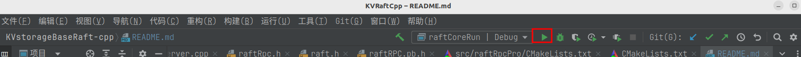

# KVstorageBaseRaft-cpp

## Branch Descriptions
- main: Latest content, with a simple clerk implemented.
- rpc：Related content based on the muduo and RPC framework.
- raft_DB：A key-value storage database based on Raft, mainly used for observing the election process.

## Usage Instructions

### 1.Library Preparation
- muduo
- boost
- protoc
- clang-format（optional）

**Installation Instructions**

- protoc，The local version used is 3.12.4. For Ubuntu 22, you can install it using sudo apt-get install protobuf-compiler libprotobuf-dev, which should default to this version.
- boost，Install it using sudo apt-get install libboost-dev libboost-test-dev libboost-all-dev.

### 2.Compilation and Execution
#### Using rpc
```
mkdir cmake-build-debug
cd cmake-build-debug
cmake ..
make
```
After this, the corresponding executable files will be generated in the bin directory:
- consumer
- provider
Run them as needed, ensuring that you start the provider first, followed by the consumer. The reason is simple: the RPC service must be provided before it can be invoked.

#### Using the Raft Cluster
```
mkdir cmake-build-debug
cd cmake-build-debug
cmake..
make
```
After this, the corresponding executable files will be generated in the bin directory. To run, execute:
```
// make sure you in bin directory ,and this has a test.conf file
raftCoreRun -n 3 -f test.conf
```
It is recommended to use a one-click run feature via CLion or CLion Nova; you can simply click the button to execute:


Once running successfully, the command line should display Raft operation output similar to the following:：
```
20231228 13:04:40.570744Z 615779 INFO  TcpServer::newConnection [RpcProvider] - new connection [RpcProvider-127.0.1.1:16753#2] from 127.0.0.1:37234 - TcpServer.cc:80
[2023-12-28-21-4-41] [Init&ReInit] Sever 0, term 0, lastSnapshotIncludeIndex {0} , lastSnapshotIncludeTerm {0}
[2023-12-28-21-4-41] [Init&ReInit] Sever 1, term 0, lastSnapshotIncludeIndex {0} , lastSnapshotIncludeTerm {0}
[2023-12-28-21-4-41] [Init&ReInit] Sever 2, term 0, lastSnapshotIncludeIndex {0} , lastSnapshotIncludeTerm {0}
[2023-12-28-21-4-41] [       ticker-func-rf(1)              ]  Election timer expired and not a leader, starting election

[2023-12-28-21-4-41] [func-sendRequestVote rf{1}] Sending RequestVote to server{1} started
[2023-12-28-21-4-41] [func-sendRequestVote rf{1}] Sending RequestVote to server{1} completed, took {0} ms
[2023-12-28-21-4-41] [func-sendRequestVote rf{1}] Election success, current term: {1}, lastLogIndex: {0}

[2023-12-28-21-4-41] [func-Raft::doHeartBeat()-Leader: {1}] Leader's heartbeat timer triggered
[2023-12-28-21-4-41] [func-Raft::sendAppendEntries-raft{1}] Leader sending AppendEntries RPC to node {0}, args->entries_size(): {0}
[2023-12-28-21-4-41] [func-Raft::doHeartBeat()-Leader: {1}] Leader's heartbeat timer triggered
```

#### Using the Key-Value Store
After starting the Raft cluster, simply run callerMain.

## todoList

- [x] Complete Raft cluster functionality
- [ ] Remove redundant libraries: muduo, boost
- [ ] Code refactoring and optimization
- [x] code format


